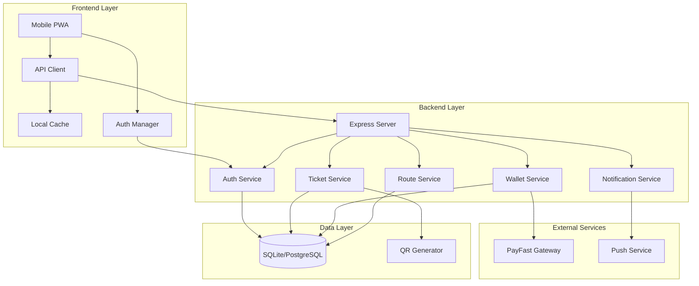
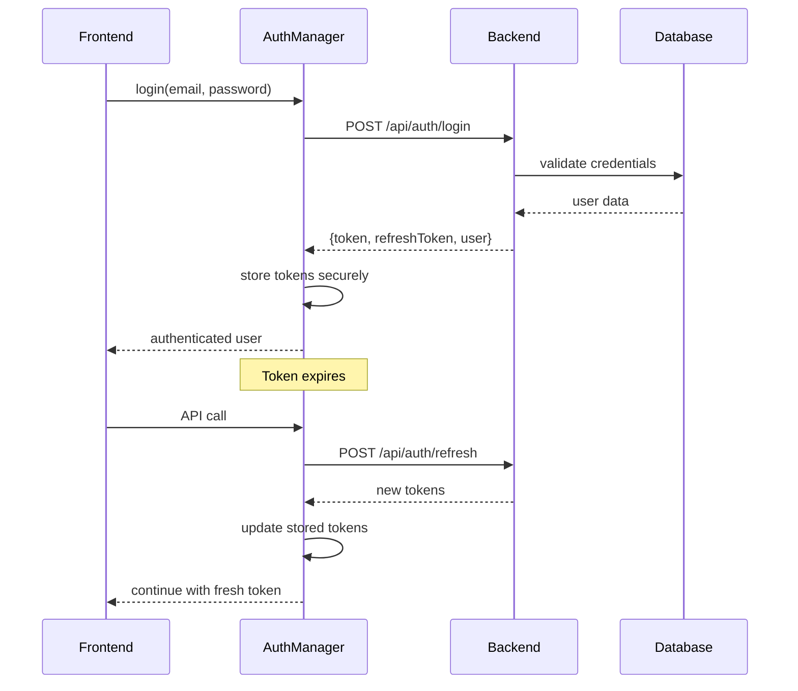
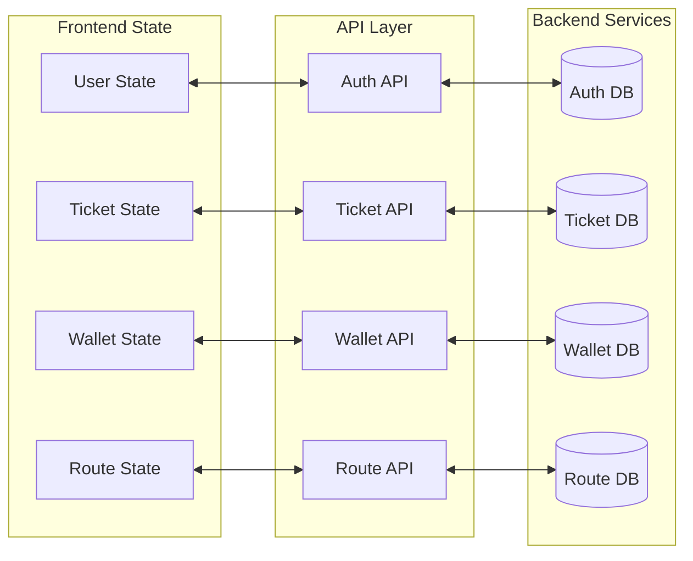

# Backend Integration Design Document

## Overview

This design document outlines the integration between the CapeConnect mobile-responsive frontend and the existing Node.js/Express backend. The integration transforms the current demo-based mobile app into a fully functional transit ticketing system by connecting to real APIs for authentication, ticket management, wallet operations, route data, and payment processing.

The backend already provides comprehensive REST APIs with JWT authentication, PayFast payment integration, QR code generation, and SQLite/PostgreSQL database support. The frontend integration focuses on replacing mock data with real API calls while maintaining the existing user experience and adding robust error handling, offline support, and security measures.

### Key Integration Points

- **Authentication Flow**: JWT-based login/register with automatic token refresh
- **Ticket Operations**: Real ticket creation, QR code generation, and status management
- **Wallet Management**: Live balance tracking, transaction history, and PayFast top-ups
- **Route Data**: Dynamic timetables and fare information from backend services
- **User Profiles**: Account management and operator service linking
- **Payment Processing**: Secure PayFast integration for wallet funding
- **Push Notifications**: Backend-driven notification system for user alerts
- **Offline Support**: Intelligent caching and sync mechanisms

## Architecture

### System Architecture



### Authentication Architecture



### Data Flow Architecture



## Components and Interfaces

### API Client Component

The API client serves as the central communication layer between frontend and backend, handling authentication, request/response processing, and error management.

```javascript
class APIClient {
  constructor(baseURL, authManager) {
    this.baseURL = baseURL;
    this.authManager = authManager;
    this.requestQueue = [];
    this.isOnline = navigator.onLine;
  }

  async request(endpoint, options = {}) {
    // Add authentication headers
    // Handle offline queueing
    // Process response and errors
    // Retry logic for failed requests
  }

  async authenticatedRequest(endpoint, options = {}) {
    // Ensure valid token before request
    // Auto-refresh expired tokens
    // Handle authentication errors
  }
}
```

### Authentication Manager

Manages JWT tokens, user sessions, and authentication state across the application.

```javascript
class AuthenticationManager {
  constructor() {
    this.accessToken = null;
    this.refreshToken = null;
    this.user = null;
    this.tokenRefreshPromise = null;
  }

  async login(email, password) {
    // Authenticate with backend
    // Store tokens securely
    // Update user state
  }

  async refreshAccessToken() {
    // Use refresh token to get new access token
    // Handle refresh token expiry
    // Update stored tokens
  }

  async logout() {
    // Revoke tokens on backend
    // Clear local storage
    // Reset authentication state
  }
}
```

### Ticket Service Integration

Connects frontend ticket operations with backend ticket management APIs.

```javascript
class TicketService {
  constructor(apiClient) {
    this.apiClient = apiClient;
    this.cache = new Map();
  }

  async purchaseTicket(ticketData) {
    // Validate wallet balance
    // Create ticket via API
    // Generate QR code
    // Update local state
  }

  async getTickets(filters = {}) {
    // Fetch tickets from API
    // Cache for offline access
    // Return formatted ticket data
  }

  async useTicket(ticketId) {
    // Update ticket status via API
    // Handle validation errors
    // Sync local cache
  }
}
```

### Wallet Service Integration

Manages wallet operations, balance tracking, and payment processing integration.

```javascript
class WalletService {
  constructor(apiClient, paymentService) {
    this.apiClient = apiClient;
    this.paymentService = paymentService;
    this.balance = 0;
    this.transactions = [];
  }

  async getWallet() {
    // Fetch current wallet data
    // Update local balance
    // Cache transaction history
  }

  async topUpWallet(amount) {
    // Initiate PayFast payment
    // Handle payment completion
    // Update wallet balance
  }

  async spendFromWallet(amount, description) {
    // Validate sufficient balance
    // Process debit transaction
    // Update local balance
  }
}
```

### Route Data Service

Provides live timetable and route information with caching for offline access.

```javascript
class RouteDataService {
  constructor(apiClient) {
    this.apiClient = apiClient;
    this.routeCache = new Map();
    this.timetableCache = new Map();
  }

  async getRoutes(operator) {
    // Fetch routes from API
    // Cache for offline access
    // Return formatted route data
  }

  async getTimetable(routeId) {
    // Fetch timetable from API
    // Cache with expiry
    // Handle offline scenarios
  }

  async getFares(routeId) {
    // Get current fare information
    // Cache fare data
    // Return pricing structure
  }
}
```

### Offline Sync Manager

Handles offline operations, data caching, and synchronization when connectivity returns.

```javascript
class OfflineSyncManager {
  constructor(apiClient) {
    this.apiClient = apiClient;
    this.pendingActions = [];
    this.cachedData = new Map();
    this.isOnline = navigator.onLine;
  }

  queueAction(action) {
    // Add action to pending queue
    // Store in persistent storage
    // Attempt immediate sync if online
  }

  async syncPendingActions() {
    // Process queued actions
    // Handle conflicts
    // Update local state
  }

  cacheData(key, data, expiry) {
    // Store data with expiry
    // Manage cache size limits
    // Handle cache invalidation
  }
}
```

## Data Models

### User Authentication Model

```typescript
interface AuthenticatedUser {
  id: string;
  email: string;
  fullName: string;
  phone?: string;
  role: 'passenger' | 'admin';
  status: 'ACTIVE' | 'INACTIVE';
  operator?: string;
  buses: string[]; // Linked transit services
  bankDetails: BankDetails;
}

interface AuthTokens {
  accessToken: string;
  refreshToken: string;
  expiresAt: string;
  refreshExpiresAt: string;
}

interface BankDetails {
  bankName: string;
  branchName: string;
  branchCode: string;
  country: string;
  accountNumber: string;
  accountType: string;
  currency: string;
  accountHolderConfirmed: boolean;
}
```

### Ticket Data Model

```typescript
interface Ticket {
  id: string;
  userId: string;
  operator: string;
  productType: string;
  productName: string;
  journeysIncluded?: number;
  journeysUsed: number;
  routeFrom?: string;
  routeTo?: string;
  amountCents: number;
  currency: string;
  status: 'PAID' | 'USED' | 'EXPIRED' | 'REFUNDED';
  purchasedAt: string;
  validFrom: string;
  validUntil?: string;
  paymentMethod: string;
  cardAlias?: string;
  qrCode?: string;
  qrCodeSVG?: string;
  meta: Record<string, any>;
}

interface TicketPurchaseRequest {
  operator: string;
  productType: string;
  productName: string;
  journeysIncluded?: number;
  routeFrom?: string;
  routeTo?: string;
  amountCents: number;
  paymentMethod: string;
  cardAlias?: string;
}
```

### Wallet Data Model

```typescript
interface Wallet {
  userId: string;
  balanceCents: number;
  currency: string;
  operator?: string;
  createdAt: string;
  updatedAt: string;
}

interface WalletTransaction {
  id: string;
  userId: string;
  type: 'TOPUP' | 'DEBIT' | 'REFUND';
  amountCents: number;
  refTicketId?: string;
  note?: string;
  createdAt: string;
  balanceBeforeCents?: number;
  balanceAfterCents?: number;
  paymentId?: string;
}

interface PaymentRequest {
  amount: number; // in cents
  description: string;
  returnUrl?: string;
  cancelUrl?: string;
}
```

### Route and Timetable Models

```typescript
interface Route {
  id: string;
  operator: string;
  routeName: string;
  routeCode: string;
  fromLocation: string;
  toLocation: string;
  distance?: number;
  estimatedDuration?: number;
  isActive: boolean;
}

interface TimetableEntry {
  id: string;
  routeId: string;
  departureTime: string;
  arrivalTime: string;
  dayOfWeek: number;
  isActive: boolean;
  vehicleType?: string;
  fare?: number;
}

interface FareStructure {
  routeId: string;
  operator: string;
  baseFare: number;
  currency: string;
  fareType: 'SINGLE' | 'RETURN' | 'DAILY' | 'WEEKLY' | 'MONTHLY';
  validityDays?: number;
  journeysIncluded?: number;
}
```
### API Integration Specifications

#### Authentication Endpoints

```typescript
// POST /api/auth/login
interface LoginRequest {
  email: string;
  password: string;
}

interface LoginResponse {
  token: string;
  expiresAt: string;
  refreshToken: string;
  refreshExpiresAt: string;
  user: AuthenticatedUser;
}

// POST /api/auth/register
interface RegisterRequest {
  fullName: string;
  email: string;
  phone?: string;
  password: string;
}

// POST /api/auth/refresh
interface RefreshRequest {
  refreshToken: string;
}

// GET /api/auth/me
interface UserProfileResponse {
  user: AuthenticatedUser;
}

// PATCH /api/auth/me
interface UpdateProfileRequest {
  fullName?: string;
  phone?: string;
  operator?: string;
  buses?: string[];
  bankDetails?: Partial<BankDetails>;
}
```

#### Ticket Management Endpoints

```typescript
// GET /api/tickets
interface GetTicketsRequest {
  status?: 'PAID' | 'USED' | 'EXPIRED';
  operator?: string;
  from?: string;
  to?: string;
}

interface GetTicketsResponse {
  tickets: Ticket[];
}

// POST /api/tickets
interface CreateTicketResponse {
  ticket: Ticket;
}

// POST /api/tickets/:id/use
interface UseTicketResponse {
  ticket: Ticket;
}

// POST /api/tickets/verify-qr
interface VerifyQRRequest {
  qrData: string;
}

interface VerifyQRResponse {
  valid: boolean;
  ticket: Partial<Ticket>;
  message: string;
}
```

#### Wallet Management Endpoints

```typescript
// GET /api/wallets/me
interface GetWalletResponse {
  wallet: Wallet;
  transactions: WalletTransaction[];
}

// POST /api/wallets/topup
interface TopupRequest {
  amountCents: number;
  operator?: string;
  note?: string;
}

interface TopupResponse {
  wallet: Wallet;
}

// POST /api/wallets/spend
interface SpendRequest {
  amountCents: number;
  operator?: string;
  note?: string;
}
```

#### Payment Processing Endpoints

```typescript
// POST /api/payments/topup/initiate
interface InitiatePaymentRequest {
  amount: number; // in cents
}

interface InitiatePaymentResponse {
  success: boolean;
  paymentId: string;
  paymentUrl: string;
  paymentData: PayFastPaymentData;
  reference: string;
}

// GET /api/payments/status/:paymentId
interface PaymentStatusResponse {
  id: string;
  amount: number;
  currency: string;
  status: 'PENDING' | 'COMPLETED' | 'FAILED' | 'CANCELLED';
  description: string;
  reference: string;
  createdAt: string;
  completedAt?: string;
}

// GET /api/payments/history
interface PaymentHistoryResponse {
  payments: PaymentStatusResponse[];
  pagination: {
    limit: number;
    offset: number;
    hasMore: boolean;
  };
}
```

### Error Handling Specifications

#### Error Response Format

```typescript
interface APIError {
  error: string;
  code?: string;
  details?: Record<string, any>;
  timestamp?: string;
}

// Standard HTTP Status Codes
// 400: Bad Request - Invalid input data
// 401: Unauthorized - Invalid or expired token
// 403: Forbidden - Insufficient permissions
// 404: Not Found - Resource not found
// 409: Conflict - Resource already exists
// 422: Unprocessable Entity - Validation errors
// 500: Internal Server Error - Server-side errors
```

#### Frontend Error Handling Strategy

```typescript
class ErrorHandler {
  static handleAPIError(error: APIError, context: string): UserFriendlyError {
    switch (error.code) {
      case 'INSUFFICIENT_BALANCE':
        return {
          title: 'Insufficient Funds',
          message: 'Please top up your wallet to continue.',
          action: 'topup'
        };
      case 'TICKET_EXPIRED':
        return {
          title: 'Ticket Expired',
          message: 'This ticket is no longer valid.',
          action: 'purchase'
        };
      case 'NETWORK_ERROR':
        return {
          title: 'Connection Issue',
          message: 'Please check your internet connection.',
          action: 'retry'
        };
      default:
        return {
          title: 'Something went wrong',
          message: 'Please try again later.',
          action: 'retry'
        };
    }
  }
}
```

### Security Implementation

#### Token Management

```typescript
class SecureTokenStorage {
  private static readonly ACCESS_TOKEN_KEY = 'cc_access_token';
  private static readonly REFRESH_TOKEN_KEY = 'cc_refresh_token';
  
  static storeTokens(accessToken: string, refreshToken: string): void {
    // Use secure storage mechanisms
    // Consider encryption for sensitive data
    sessionStorage.setItem(this.ACCESS_TOKEN_KEY, accessToken);
    localStorage.setItem(this.REFRESH_TOKEN_KEY, refreshToken);
  }
  
  static getAccessToken(): string | null {
    return sessionStorage.getItem(this.ACCESS_TOKEN_KEY);
  }
  
  static getRefreshToken(): string | null {
    return localStorage.getItem(this.REFRESH_TOKEN_KEY);
  }
  
  static clearTokens(): void {
    sessionStorage.removeItem(this.ACCESS_TOKEN_KEY);
    localStorage.removeItem(this.REFRESH_TOKEN_KEY);
  }
}
```

#### Request Security

```typescript
class SecureAPIClient extends APIClient {
  async authenticatedRequest(endpoint: string, options: RequestOptions = {}): Promise<any> {
    const token = SecureTokenStorage.getAccessToken();
    
    if (!token) {
      throw new Error('No authentication token available');
    }
    
    const headers = {
      ...options.headers,
      'Authorization': `Bearer ${token}`,
      'Content-Type': 'application/json',
      'X-Requested-With': 'XMLHttpRequest'
    };
    
    try {
      return await this.request(endpoint, { ...options, headers });
    } catch (error) {
      if (error.status === 401) {
        // Token expired, attempt refresh
        await this.authManager.refreshAccessToken();
        // Retry with new token
        const newToken = SecureTokenStorage.getAccessToken();
        headers.Authorization = `Bearer ${newToken}`;
        return await this.request(endpoint, { ...options, headers });
      }
      throw error;
    }
  }
}
```

### Offline Support Implementation

#### Cache Strategy

```typescript
class OfflineCache {
  private static readonly CACHE_PREFIX = 'cc_cache_';
  private static readonly CACHE_EXPIRY = 5 * 60 * 1000; // 5 minutes
  
  static set(key: string, data: any, expiry?: number): void {
    const cacheData = {
      data,
      timestamp: Date.now(),
      expiry: expiry || this.CACHE_EXPIRY
    };
    localStorage.setItem(this.CACHE_PREFIX + key, JSON.stringify(cacheData));
  }
  
  static get(key: string): any | null {
    const cached = localStorage.getItem(this.CACHE_PREFIX + key);
    if (!cached) return null;
    
    const cacheData = JSON.parse(cached);
    if (Date.now() - cacheData.timestamp > cacheData.expiry) {
      this.remove(key);
      return null;
    }
    
    return cacheData.data;
  }
  
  static remove(key: string): void {
    localStorage.removeItem(this.CACHE_PREFIX + key);
  }
}
```

#### Sync Queue Implementation

```typescript
class SyncQueue {
  private queue: QueuedAction[] = [];
  private isProcessing = false;
  
  async addAction(action: QueuedAction): Promise<void> {
    this.queue.push(action);
    this.persistQueue();
    
    if (navigator.onLine && !this.isProcessing) {
      await this.processQueue();
    }
  }
  
  async processQueue(): Promise<void> {
    if (this.isProcessing || !navigator.onLine) return;
    
    this.isProcessing = true;
    
    while (this.queue.length > 0) {
      const action = this.queue.shift();
      try {
        await this.executeAction(action);
      } catch (error) {
        // Re-queue failed actions
        this.queue.unshift(action);
        break;
      }
    }
    
    this.persistQueue();
    this.isProcessing = false;
  }
  
  private async executeAction(action: QueuedAction): Promise<void> {
    switch (action.type) {
      case 'TICKET_PURCHASE':
        await this.apiClient.post('/api/tickets', action.data);
        break;
      case 'PROFILE_UPDATE':
        await this.apiClient.patch('/api/auth/me', action.data);
        break;
      // Handle other action types
    }
  }
}
```

### Performance Optimization

#### Request Batching

```typescript
class RequestBatcher {
  private batchQueue: Map<string, BatchedRequest[]> = new Map();
  private batchTimers: Map<string, NodeJS.Timeout> = new Map();
  private readonly BATCH_DELAY = 100; // ms
  
  async batchRequest(endpoint: string, data: any): Promise<any> {
    return new Promise((resolve, reject) => {
      const batchKey = this.getBatchKey(endpoint);
      
      if (!this.batchQueue.has(batchKey)) {
        this.batchQueue.set(batchKey, []);
      }
      
      this.batchQueue.get(batchKey)!.push({ data, resolve, reject });
      
      // Clear existing timer and set new one
      if (this.batchTimers.has(batchKey)) {
        clearTimeout(this.batchTimers.get(batchKey)!);
      }
      
      this.batchTimers.set(batchKey, setTimeout(() => {
        this.processBatch(batchKey);
      }, this.BATCH_DELAY));
    });
  }
  
  private async processBatch(batchKey: string): Promise<void> {
    const requests = this.batchQueue.get(batchKey) || [];
    this.batchQueue.delete(batchKey);
    this.batchTimers.delete(batchKey);
    
    if (requests.length === 0) return;
    
    try {
      // Process batch request
      const results = await this.apiClient.post(`/api/batch/${batchKey}`, {
        requests: requests.map(r => r.data)
      });
      
      // Resolve individual promises
      requests.forEach((request, index) => {
        request.resolve(results[index]);
      });
    } catch (error) {
      // Reject all promises in batch
      requests.forEach(request => {
        request.reject(error);
      });
    }
  }
}
```

#### Memory Management

```typescript
class MemoryManager {
  private static readonly MAX_CACHE_SIZE = 50 * 1024 * 1024; // 50MB
  private static cacheSize = 0;
  
  static trackCacheUsage(key: string, data: any): void {
    const size = this.calculateSize(data);
    this.cacheSize += size;
    
    if (this.cacheSize > this.MAX_CACHE_SIZE) {
      this.evictOldestEntries();
    }
  }
  
  private static calculateSize(obj: any): number {
    return JSON.stringify(obj).length * 2; // Rough estimate
  }
  
  private static evictOldestEntries(): void {
    // Implement LRU eviction strategy
    const cacheKeys = Object.keys(localStorage)
      .filter(key => key.startsWith('cc_cache_'))
      .map(key => ({
        key,
        timestamp: JSON.parse(localStorage.getItem(key) || '{}').timestamp || 0
      }))
      .sort((a, b) => a.timestamp - b.timestamp);
    
    // Remove oldest 25% of entries
    const toRemove = Math.ceil(cacheKeys.length * 0.25);
    for (let i = 0; i < toRemove; i++) {
      localStorage.removeItem(cacheKeys[i].key);
    }
    
    this.recalculateCacheSize();
  }
}
```
## Correctness Properties

*A property is a characteristic or behavior that should hold true across all valid executions of a system-essentially, a formal statement about what the system should do. Properties serve as the bridge between human-readable specifications and machine-verifiable correctness guarantees.*

After analyzing the acceptance criteria, several properties can be combined to eliminate redundancy and provide comprehensive validation coverage. The following properties represent the core correctness guarantees for the backend integration system.

### Property 1: Authentication Flow Completeness

*For any* valid user credentials, the authentication flow should complete successfully, returning access tokens, refresh tokens, and user data, and the frontend should store these securely and maintain authentication state.

**Validates: Requirements 1.1, 1.2**

### Property 2: Token Refresh Mechanism

*For any* expired access token with a valid refresh token, the system should automatically refresh the access token and continue the original request without user intervention.

**Validates: Requirements 1.3**

### Property 3: Logout State Cleanup

*For any* authenticated user session, logout should revoke all tokens on the backend, clear local authentication state, and redirect to the login screen.

**Validates: Requirements 1.4**

### Property 4: Authentication Error Handling

*For any* invalid credentials or authentication failures, the system should display appropriate error messages without exposing sensitive information and handle authentication errors by redirecting to login.

**Validates: Requirements 1.7, 8.4**

### Property 5: Ticket Purchase and QR Generation

*For any* valid ticket purchase request with sufficient wallet balance, the system should create the ticket, generate a valid QR code, deduct the wallet balance, and record the transaction.

**Validates: Requirements 2.1, 2.4, 3.3**

### Property 6: Ticket Status Management

*For any* ticket, the system should accurately track and update ticket status (paid, used, expired) based on usage and time, and reflect these changes immediately in the frontend.

**Validates: Requirements 2.3, 2.5, 2.6, 2.7**

### Property 7: Wallet Balance Consistency

*For any* sequence of wallet operations (top-ups, purchases, debits), the wallet balance should remain mathematically consistent, and all transactions should be properly recorded with accurate before/after balances.

**Validates: Requirements 3.1, 3.2, 3.5, 3.7**

### Property 8: Insufficient Funds Protection

*For any* ticket purchase attempt where the wallet balance is less than the ticket price, the system should prevent the purchase, return an appropriate error, and not create any tickets or deduct funds.

**Validates: Requirements 3.6**

### Property 9: Route Data Synchronization

*For any* route or timetable data request, the system should return current data from the backend, cache it for offline access, and sync with the latest data when connectivity is restored.

**Validates: Requirements 4.1, 4.2, 4.4, 4.5, 4.6**

### Property 10: Multi-Operator Support

*For any* supported transit operator (MyCiTi, Golden Arrow), the system should handle their specific data formats, fare structures, and operational requirements consistently.

**Validates: Requirements 4.7**

### Property 11: Profile Management Consistency

*For any* profile update operation, the system should validate the data, save changes to the backend, and immediately reflect updates in the frontend, or display specific validation errors if the data is invalid.

**Validates: Requirements 5.1, 5.2, 5.4, 5.5, 5.6, 5.7**

### Property 12: Payment Processing Integrity

*For any* payment transaction, the system should securely redirect to the payment gateway, process completion notifications, update wallet balances or create tickets only upon confirmed payment, and record all transaction details for audit.

**Validates: Requirements 6.1, 6.2, 6.3, 6.6, 6.7**

### Property 13: Payment Failure Handling

*For any* failed payment attempt, the system should display appropriate error messages, not create tickets or update balances, and maintain data integrity.

**Validates: Requirements 6.4**

### Property 14: Notification System Reliability

*For any* notification trigger (ticket expiry, route disruption, low balance), the system should send notifications to registered users, respect their preferences, track delivery status, and display notifications appropriately in the frontend.

**Validates: Requirements 7.1, 7.2, 7.3, 7.4, 7.5, 7.6, 7.7**

### Property 15: Error Handling and User Feedback

*For any* API error (network, validation, server), the system should display appropriate user-friendly error messages, implement retry logic for transient failures, and log errors for debugging without exposing technical details.

**Validates: Requirements 8.1, 8.2, 8.3, 8.5, 8.6, 8.7**

### Property 16: Offline Operation and Sync

*For any* offline scenario, the system should display cached data, queue user actions that require server communication, sync queued actions when connectivity returns, and prioritize server data over cached data in case of conflicts.

**Validates: Requirements 9.1, 9.2, 9.3, 9.4, 9.5**

### Property 17: Offline Status and Critical Operations

*For any* critical operation that requires server connectivity, the system should prevent offline execution, clearly indicate offline status to users, and inform them when connectivity is required.

**Validates: Requirements 9.6, 9.7**

### Property 18: Security State Management

*For any* security-sensitive operation, the system should invalidate compromised or expired tokens immediately, require recent authentication confirmation for sensitive operations, automatically log out users after inactivity, and update the UI immediately when authentication state changes.

**Validates: Requirements 10.2, 10.4, 10.5, 10.6**

## Error Handling

### Error Classification and Response Strategy

The system implements a comprehensive error handling strategy that categorizes errors by type and provides appropriate user feedback and recovery mechanisms.

#### Network and Connectivity Errors

- **Connection Timeout**: Implement exponential backoff retry with user notification
- **Network Unavailable**: Switch to offline mode and queue operations
- **DNS Resolution Failure**: Display connectivity error with retry option
- **SSL/TLS Errors**: Display security error and prevent insecure connections

#### Authentication and Authorization Errors

- **Invalid Credentials**: Display clear error message without revealing account existence
- **Token Expired**: Automatically attempt refresh, fallback to login redirect
- **Insufficient Permissions**: Display access denied message with appropriate guidance
- **Account Locked**: Display account status with recovery instructions

#### Validation and Business Logic Errors

- **Invalid Input Data**: Display field-specific validation errors
- **Insufficient Funds**: Display balance information with top-up option
- **Ticket Already Used**: Display ticket status with purchase option
- **Route Not Available**: Display alternative route suggestions

#### Server and System Errors

- **Internal Server Error**: Display generic error message with retry option
- **Service Unavailable**: Display maintenance message with estimated recovery time
- **Rate Limiting**: Display throttling message with retry guidance
- **Database Errors**: Log for debugging, display generic error to user

### Error Recovery Mechanisms

#### Automatic Recovery

```typescript
class ErrorRecoveryManager {
  private retryAttempts = new Map<string, number>();
  private readonly maxRetries = 3;
  private readonly retryDelay = 1000; // Base delay in ms

  async executeWithRetry<T>(
    operation: () => Promise<T>,
    operationId: string,
    isRetryable: (error: any) => boolean = this.isRetryableError
  ): Promise<T> {
    const attempts = this.retryAttempts.get(operationId) || 0;
    
    try {
      const result = await operation();
      this.retryAttempts.delete(operationId); // Reset on success
      return result;
    } catch (error) {
      if (attempts < this.maxRetries && isRetryable(error)) {
        this.retryAttempts.set(operationId, attempts + 1);
        const delay = this.retryDelay * Math.pow(2, attempts); // Exponential backoff
        
        await this.delay(delay);
        return this.executeWithRetry(operation, operationId, isRetryable);
      }
      
      this.retryAttempts.delete(operationId);
      throw error;
    }
  }

  private isRetryableError(error: any): boolean {
    // Network errors, timeouts, and 5xx server errors are retryable
    return error.code === 'NETWORK_ERROR' || 
           error.code === 'TIMEOUT' || 
           (error.status >= 500 && error.status < 600);
  }
}
```

#### User-Initiated Recovery

```typescript
class UserRecoveryActions {
  static getRecoveryActions(error: APIError): RecoveryAction[] {
    switch (error.code) {
      case 'INSUFFICIENT_BALANCE':
        return [
          { label: 'Top Up Wallet', action: 'navigate', target: '/wallet/topup' },
          { label: 'View Balance', action: 'navigate', target: '/wallet' }
        ];
      
      case 'TICKET_EXPIRED':
        return [
          { label: 'Buy New Ticket', action: 'navigate', target: '/tickets/purchase' },
          { label: 'View Active Tickets', action: 'navigate', target: '/tickets' }
        ];
      
      case 'NETWORK_ERROR':
        return [
          { label: 'Retry', action: 'retry', target: null },
          { label: 'Go Offline', action: 'offline_mode', target: null }
        ];
      
      default:
        return [
          { label: 'Retry', action: 'retry', target: null },
          { label: 'Contact Support', action: 'external', target: 'mailto:support@capeconnect.co.za' }
        ];
    }
  }
}
```

### Error Logging and Monitoring

#### Client-Side Error Tracking

```typescript
class ErrorLogger {
  private static readonly LOG_ENDPOINT = '/api/errors/log';
  private errorQueue: ErrorLog[] = [];

  static logError(error: Error, context: ErrorContext): void {
    const errorLog: ErrorLog = {
      id: this.generateId(),
      timestamp: new Date().toISOString(),
      message: error.message,
      stack: error.stack,
      context: {
        ...context,
        userAgent: navigator.userAgent,
        url: window.location.href,
        userId: this.getCurrentUserId()
      },
      severity: this.determineSeverity(error, context)
    };

    this.errorQueue.push(errorLog);
    this.flushErrorQueue();
  }

  private static async flushErrorQueue(): Promise<void> {
    if (this.errorQueue.length === 0) return;

    try {
      await fetch(this.LOG_ENDPOINT, {
        method: 'POST',
        headers: { 'Content-Type': 'application/json' },
        body: JSON.stringify({ errors: this.errorQueue })
      });
      
      this.errorQueue = [];
    } catch (error) {
      // Store in local storage for later retry
      localStorage.setItem('pending_error_logs', JSON.stringify(this.errorQueue));
    }
  }
}
```

## Testing Strategy

The testing strategy employs a dual approach combining unit tests for specific scenarios and property-based tests for comprehensive validation across all possible inputs.

### Unit Testing Approach

Unit tests focus on specific examples, edge cases, and integration points between components. They provide concrete validation of expected behavior and serve as documentation for system requirements.

**Key Unit Test Categories:**

- **Authentication Flow Tests**: Login, registration, token refresh, logout scenarios
- **API Integration Tests**: Request/response handling, error scenarios, timeout handling
- **Offline Functionality Tests**: Cache behavior, sync queue operations, conflict resolution
- **Payment Integration Tests**: PayFast integration, webhook handling, transaction recording
- **UI Component Tests**: Error display, loading states, user feedback mechanisms

### Property-Based Testing Configuration

Property-based tests validate universal properties across randomized inputs, ensuring system correctness under all conditions. Each test runs a minimum of 100 iterations to achieve statistical confidence.

**Testing Library**: For JavaScript/TypeScript, we'll use `fast-check` for property-based testing
**Configuration**: Minimum 100 iterations per property test
**Tagging Format**: Each test includes a comment referencing the design property

```typescript
// Example property test structure
describe('Backend Integration Properties', () => {
  test('Property 1: Authentication Flow Completeness', () => {
    // Feature: backend-integration, Property 1: Authentication flow should complete successfully for valid credentials
    fc.assert(fc.property(
      fc.record({
        email: fc.emailAddress(),
        password: fc.string({ minLength: 8 })
      }),
      async (credentials) => {
        // Test implementation
        const result = await authService.login(credentials.email, credentials.password);
        expect(result).toHaveProperty('accessToken');
        expect(result).toHaveProperty('refreshToken');
        expect(result).toHaveProperty('user');
      }
    ), { numRuns: 100 });
  });

  test('Property 7: Wallet Balance Consistency', () => {
    // Feature: backend-integration, Property 7: Wallet balance should remain consistent across operations
    fc.assert(fc.property(
      fc.array(fc.record({
        type: fc.constantFrom('topup', 'purchase', 'refund'),
        amount: fc.integer({ min: 100, max: 10000 })
      })),
      async (operations) => {
        // Test implementation
        let expectedBalance = 0;
        for (const op of operations) {
          await walletService.processOperation(op);
          expectedBalance += op.type === 'topup' ? op.amount : -op.amount;
        }
        const actualBalance = await walletService.getBalance();
        expect(actualBalance).toBe(Math.max(0, expectedBalance));
      }
    ), { numRuns: 100 });
  });
});
```

### Integration Testing Strategy

Integration tests validate the interaction between frontend components and backend APIs, ensuring proper data flow and error handling across system boundaries.

**Test Environment Setup:**
- Mock backend server for controlled testing scenarios
- Test database with known data sets
- Simulated network conditions (slow, intermittent, offline)
- PayFast sandbox environment for payment testing

**Critical Integration Test Scenarios:**
- End-to-end ticket purchase flow with payment processing
- Authentication token refresh during long-running operations
- Offline-to-online synchronization with conflict resolution
- Multi-operator data handling and switching
- Push notification registration and delivery

### Performance Testing

Performance tests ensure the system meets responsiveness requirements under various load conditions and network scenarios.

**Performance Benchmarks:**
- API response times < 2 seconds under normal conditions
- UI responsiveness maintained during background sync operations
- Memory usage stays within mobile device constraints
- Offline mode activation < 500ms when connectivity lost
- Cache operations complete within 100ms

**Load Testing Scenarios:**
- Concurrent user authentication and ticket purchases
- Large transaction history retrieval and display
- Bulk notification delivery and processing
- Cache invalidation and refresh under load
- Payment webhook processing during high transaction volumes

### Security Testing

Security tests validate authentication mechanisms, data protection, and secure communication protocols.

**Security Test Categories:**
- Token security and expiration handling
- HTTPS enforcement and certificate validation
- Input validation and sanitization
- XSS and CSRF protection mechanisms
- Secure storage of sensitive data

**Penetration Testing Scenarios:**
- Attempt to access APIs with expired or invalid tokens
- Test for sensitive data exposure in error messages
- Validate secure token storage mechanisms
- Test payment flow security and data protection
- Verify proper session management and logout procedures